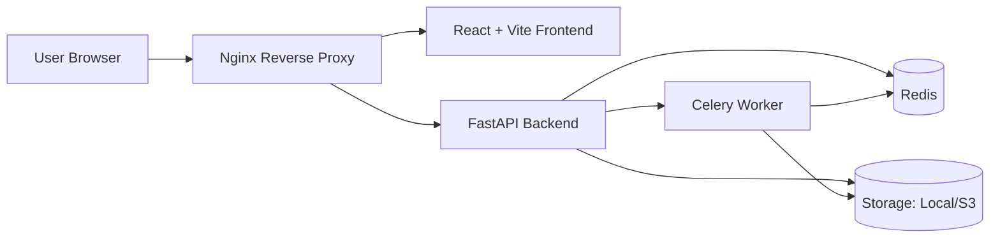

# FileConvert Monorepo

Initial project layout for a file conversion platform.

## Repository Layout

- `backend/` — FastAPI app, APIs, worker orchestration, storage adapters.
- `frontend/` — React + Vite + TypeScript UI for upload, conversion, job tracking, and history.
- `infra/` — Docker Compose stack, Nginx reverse proxy, environment templates.
- `docs/` — Architecture notes, API spec, conversion matrix.

## Local Run Instructions

1. Copy environment template:
   ```bash
   cp infra/.env.example infra/.env
   ```
2. Start stack:
   ```bash
   docker compose -f infra/docker-compose.yml --env-file infra/.env up
   ```
3. Open app at `http://localhost:8080`.

### Direct development mode

Backend:
```bash
cd backend
pip install -r requirements.txt
uvicorn app.main:app --reload
```

Frontend:
```bash
cd frontend
npm install
npm run dev
```

## Architecture Diagram


